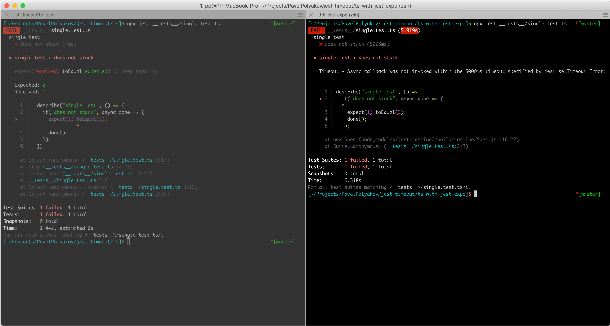

For some reason, typescript processed with `jest-expo` preset stuck if assertion fails.
Check the right side.



With regular `ts-jest` it works as expected.

# How to reproduce

## ts
```
cd ts
npm i
npx jest __tests__/single.test.ts
```

## ts with jest-expo
```
cs ts-with-jest-expo
npm i
npx jest __tests__/single.test.ts
npx jest __tests__/workaround.test.ts # this one works
```

This variant fails by timeout. Only because assertion fails. But if you wrap everything in `try/catch`, so `done()` is called - it'll be fine.

There is a workaround [workaround.tes.ts](ts-with-jest-expo/__tests__/workaround.test.ts) - this works correctly with `jest` and `jest-expo`.
